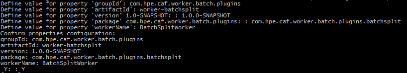

# Creating a Batch Worker

## Prerequisites

The following are prerequisite components required for the generation of a Batch Worker project from the archetype:

- Maven
- Docker VM
- IntelliJ (Optional)
- NetBeans (Optional)

## Introduction

This is a guide on how to use the `worker-batch-archetype` to generate a Batch Worker project that contains plugin
and container components. It covers archetype generation with Maven CLI, NetBeans and IntelliJ.

### Batch Worker Overview

Stateless Workers are microservices that can be scaled up or down to meet demand. In essence, a Worker should not be
aware (or need to be aware) of any other Worker or its surrounding system. This way additional "clones" of a Worker can
be created or destroyed at will to provide scaling without affecting other Workers.

Batch Workers are used to create and send multiple task messages to another worker.

When a Batch Worker receives a batch definition to process, it recursively breaks it down into smaller batches of work
and then ultimately individual tasks, which are sent to a worker.

### Project Generated from the Archetype

The following project structure is generated from the Batch Worker archetype. Each contains its own pom.xml with its own dependencies
and plugins:

**This project structure is generated from the worker-batch-archetype:**

- `worker-<artifactId>` aggregator project that contains the following modules:
    - `worker-<artifactId>-batch-plugin` module contains the batch worker plugin.
	    - **<workerName\>BatchPlugin** – responsible for doing the work. This class implements the BatchWorkerPlugin
	interface.
    - `worker-<artifactId>-container` module is for building the Docker image of the worker and pushing the image to Docker.
The module starts a container for RabbitMQ, webdav, test-configs, the worker and runs worker acceptance integration
testcases.
	    - **<workerName\>AcceptanceIT** – calls the `worker-batch-testing` dependency's BatchTestControllerProvider class
	to generate or run worker integration testing testcase files.
	    - **pom.xml** – specifies the Docker Maven Plugin configurations to build the image for the worker, and Maven
	compiler and failsafe plugin for compiling and running integration tests.

## Using the Batch Worker Archetype

A Maven Archetype is a template which you can base a project on.

Excerpt from [Apache Maven Archetype Introduction](https://maven.apache.org/guides/introduction/introduction-to-archetypes.html) :

<pre>"Archetype is a Maven project templating toolkit.
An archetype is defined as an original pattern or model from which all other things of the same kind are made."</pre>

You can create the foundations of a new Batch Worker project with the use of the `worker-batch-archetype` project.

The generation of a new project from the Batch Worker Archetype will contain some basic functionality.

It takes in a batch definition in the form of a JSON array and splits that into sub batches which are then split into individual strings.
A task message is created for each string and the string is used as the content that the downstream worker uses.

### Creating a new Batch Worker from Batch Worker Archetype

A new Batch Worker aggregator project generated from the Batch Worker Archetype has a set of properties that are
shared between its submodules:

- ArtifactID
- GroupID
- Version
- Package
- WorkerName

The following subsections provide instructions on how you can use Maven Command Line Interface (CLI),
IntelliJ Integrated Development Environment (IDE) or NetBeans IDE to create the components of a Batch Worker from the
Batch Worker Archetype. *Note: You must replace __WORKER-BATCH-ARCHETYPE-VERSION__ with a valid version of `worker-batch-archetype`.*

#### Maven CLI

The Maven CLI offers developers the ability to generate projects from archetypes with the `mvn archetype:generate`
command. The location where you run the command will be where the project is created.

##### Generate the New Batch Worker Aggregator

Generate the new Batch Worker Aggregator from the `worker-batch-archetype` with the following Maven command:
<pre>mvn archetype:generate -DarchetypeVersion=WORKER-BATCH-ARCHETYPE-VERSION -DarchetypeArtifactId=worker-batch-archetype -DarchetypeGroupId=com.hpe.caf.worker.batch</pre>

The CLI will prompt you for artifactId, groupId, version (default suggestion is 1.0-SNAPSHOT), package (default suggestion is the
groupId, you should however adjust this to include the worker's purpose) and workerName properties required for the new Batch Worker
project. See Figure 1.

*Figure 1*

If you are satisfied with the properties you have set, confirm these by typing 'Y' else if you are not satisfied type 'N' or any other
character to re-enter property values. After confirming your properties Maven will generate the new Batch Worker Aggregator project
which will contain the following submodules:

- `<artifactId>-batch-plugin` - submodule containing the Worker's backend plugin code.
- `<artifactId>-container` - submodule containing the Worker's container and testing configurations.

#### IntelliJ IDE

IntelliJ offers developers the ability to generate projects from archetypes via its GUI.

##### Generate the New Batch Worker Aggregator

Generate the new Batch Worker Aggregator from the `worker-batch-archetype` by following these instructions:

- 'File > New > Project...'
- Select Maven from the left-hand pane > Tick 'Create from archetype' > Click 'Add Archetype...'
- Specify the details of the 'worker-batch-archetype'
	- GroupId : com.hpe.caf.worker.batch
	- ArtifactId : worker-batch-archetype
	- Version : *WORKER-BATCH-ARCHETYPE-VERSION*
	- Click 'OK'
- Select the added 'com.hpe.caf.worker.batch:worker-batch-archetype' archetype > Click 'Next'
- Enter GroupId, ArtifactId and Version of your Worker project > Click 'Next', e.g:
	- GroupId : com.hpe.caf.worker.batch.plugins
	- ArtifactId : worker-batchsplit
	- Version : 1.0.0-SNAPSHOT
- Add each of the following properties (Alt+Insert) and replace the example values with your project specific values > Click 'Next':
	- package : com.hpe.caf.worker.batch.plugins.batchsplit
	- workerName : BatchSplitWorker
- Name the Project after its ArtifactId and specify the location of the project > Click 'Finish', e.g:
	- Project name : worker-batchsplit
	- Project location : C:\MyWorkerProjects\worker-batchsplit

The foundations for your new Batch Worker is now set up. The generated project will contain the following submodules:

- `<artifactId>-batch-plugin` - submodule containing the Worker's backend plugin code.
- `<artifactId>-container` - submodule containing the Worker's container and testing configurations.

#### NetBeans IDE

NetBeans offers developers the ability to generate projects from archetypes via its GUI.

##### Generate the New Batch Worker Aggregator

Generate the new Batch Worker Aggregator from the `worker-batch-archetype` by following these instructions:

- 'File > New Project...'
- From the Categories Pane select Maven > From the Select Pane select 'Project from Archetype' > Click 'Next >'
- Specify the details of the 'worker-batch-archetype'
	- GroupId : com.hpe.caf.worker.batch
	- ArtifactId : worker-batch-archetype
	- Version : *WORKER-BATCH-ARCHETYPE-VERSION*
	- Click 'Next >'
- Enter Project Name, Project Location, GroupId, Version and Package of your Worker project, e.g:
	- Project Name : worker-batchsplit
	- Project Location : C:\MyWorkerProjects
	- GroupId : com.hpe.caf.worker.batch.plugins
	- Version : 1.0.0-SNAPSHOT
	- Package : com.hpe.caf.worker.batch.plugins.batchsplit
- Set workerName property > Click 'Finish', e.g:
	- workerName : BatchSplitWorker

The foundations for your new Batch Worker is now set up. The generated project will contain the following submodules:

- `<artifactId>-batch-plugin` - submodule containing the Worker's backend plugin code.
- `<artifactId>-container` - submodule containing the Worker's container and testing configurations.

## Further Information

Information on worker-batch and its modules that the archetype utilizes can be found [here](https://github.com/JobService/worker-batch/blob/develop/worker-batch/README.md).

At the time this guide was written with:

- Apache Maven 3.3.3
- NetBeans 8.1
- IntelliJ 15